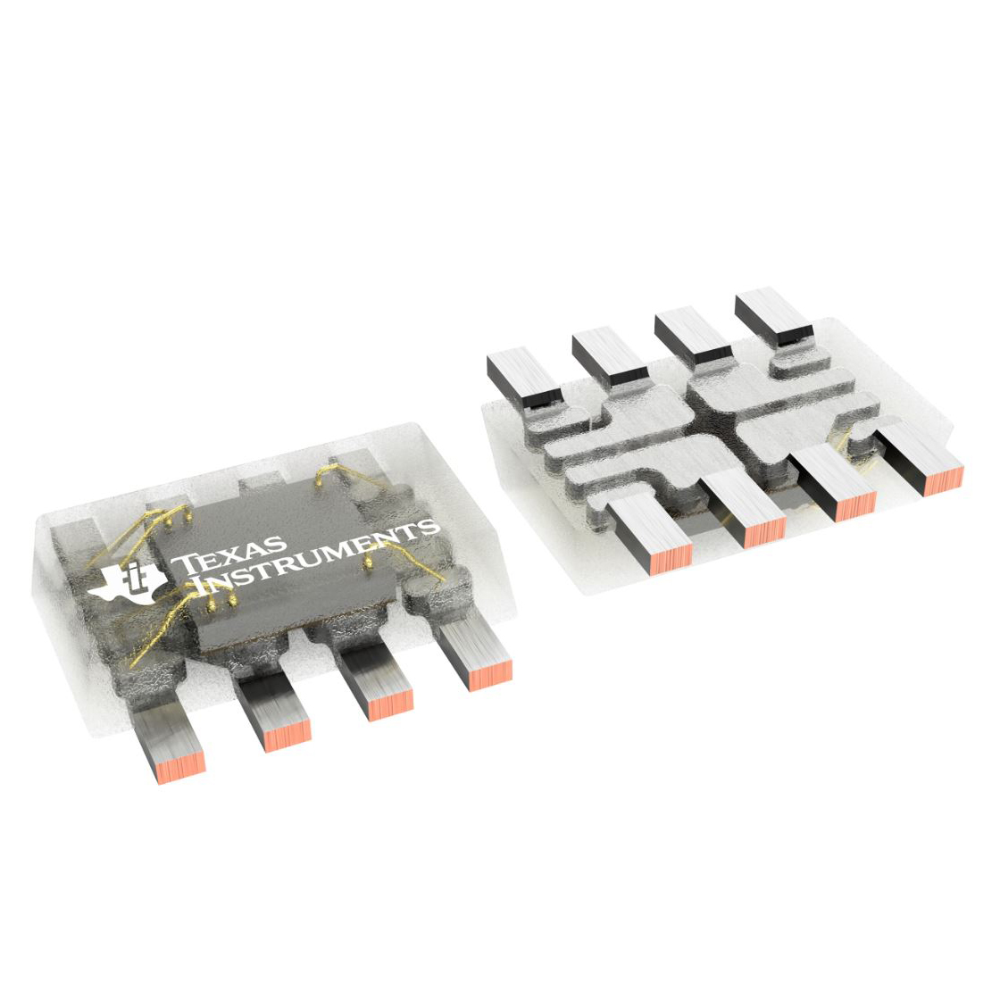
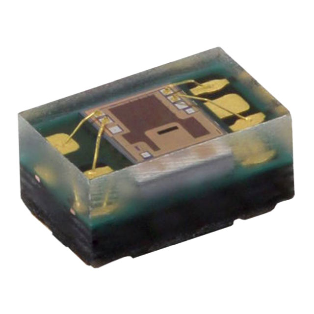
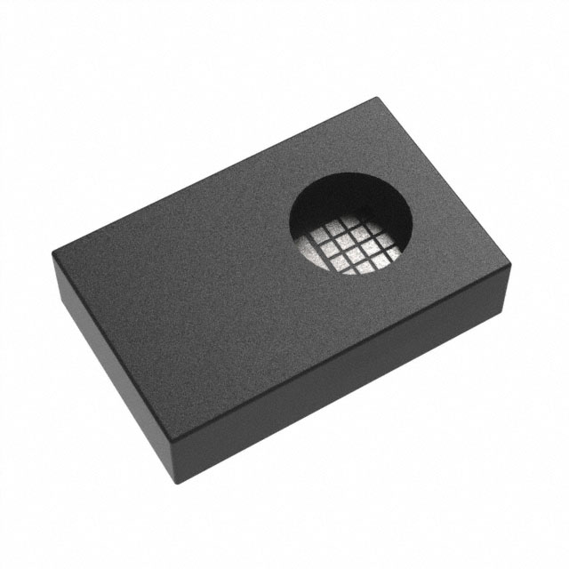
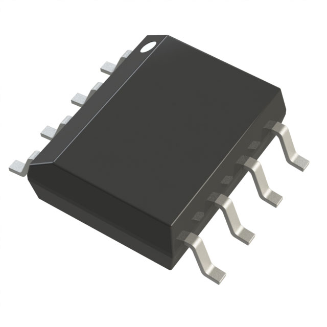

# RGB Sensor:

| Manufacturer | Part Number| Image | Pros | Cons |
|--------------|------------|-------|------|------|
| Texas Instruments | [OPT4060DTSR](https://www.digikey.com/en/products/detail/texas-instruments/OPT4060DTSR/22116843) |  | - Configurable I2C Address   - Small form factor   - Low operating power| - Complex configuration   |
| Vishay Semiconductor | [VEML3328](https://www.digikey.com/en/products/detail/vishay-semiconductor-opto-division/VEML3328/10673129) |  | - Simple configuration   - 4-Channels (RGBC)   - Integrated signal conditioning | - Fixed I2C address |
| ams-OSRAM USA INC. | [AS7341-DLGM](https://www.digikey.com/en/products/detail/ams-osram-usa-inc/AS7341-DLGM/9996230) |  | - 11-Channel full spectrum analysis   - Configurable flicker detection | - Very complex configuration   - Expensive|  

**Choice: Texas Instruments OPT4060DTSR**  
The TI OPT4060DTSR will allow for a high degree of accuracy and flexibility at a reasonable price. The sensor provides 4 channels for red, green, blue, and white light as well as an auto ranging feature. Power requirements are low, requiring only 1.6V to 3.3V to function with an operating current of 24 μA. The small form factor (2.1mm x 1.9mm x 0.6mm), low PPU ($2.88/Unit) and configurable I2C allow for multiple sensors to be implemented with ease if required.

# Voltage Regulator

| Manufacturer | Part Number| Image | Pros | Cons |
|--------------|------------|------ | ---- |------|
| Analog Devices Inc. | [ADP2302ARDZ-3.3-R7](https://www.digikey.com/en/products/detail/analog-devices-inc/ADP2302ARDZ-3-3-R7/2606526) |  | - Wide operating voltage range   - High current limit | - Low efficiency at 5Vin/3.3Vout   - Expensive|
| Texas Instruments | [LM2674MX-3.3/NOPB](https://www.digikey.com/en/products/detail/texas-instruments/LM2674MX-3-3-NOPB/366902) |  | - Wide operating voltage range   - High efficiency at 5Vin/3.3Vout| - Low current limit   - Moderately expensive |
| Microchip Technology | [MIC4680-3.3YM-TR](https://www.digikey.com/en/products/detail/microchip-technology/MIC4680-3-3YM-TR/1030018) |  | - Wide operating voltage range   - Moderate current lmit   - Affordable| - Low efficiency at 5Vin/3.3Vout |

**Choice: Texas Instruments LM2674MX-3.3**  
The TI LM2674MX-3.3 provides an efficient and stable 3.3V output with a wide range of voltage inputs. The datasheet claims it is accurate within ± 0.05V and has a possible energy efficiency of 90%. While the maximum current limit is relatively low, the overall goal of the sensor subsystem is to provide accurate measurements at low power and is unlikely to exceed 500 mA.

# Microcontroller

The sensor subsystem is required to analyze and record information about the color of marbles before they are sent to the sorting actuator subsystem. This is done by measuring the amount of red, green, and blue light reflected off the surface of the marble to return 3 8-bit values to compare with an RGB sensor, and a white illuminator LED to ensure accurate measurements. Once these values have been found, they are sent to the actuator, HMI, and internet communication subsystem via UART. The sensor subsystem is required to run off of a 3.3V power supply under 500 mA.

The Microchip [PIC18F27Q84](https://www.microchip.com/en-us/product/pic18f27q84) is the best fit for the sensor subsystem. The chip is capable of operating at the designated 3.3 volts, and provides users with 1x I2C module as well as 5X UART modules. The sensor subsystem is relatively simple, and is only required to illuminate a ball on a track with a white LED and record R/G/B information in order to determine where the ball is sent. A single I2C module should be enough to control the TI OPT4060, and only one or two pins are required to control the LEDs. Multiple UART modules may be required to communicate with the HMI, sorting actuator, return actuator, and internet communication subsystems developed by the rest of team 201. The image below shows the selected I2C module, 3x UART modules, and 2x LED GPIO pins selected in the pin manager of the MCC Melody workspace.  

