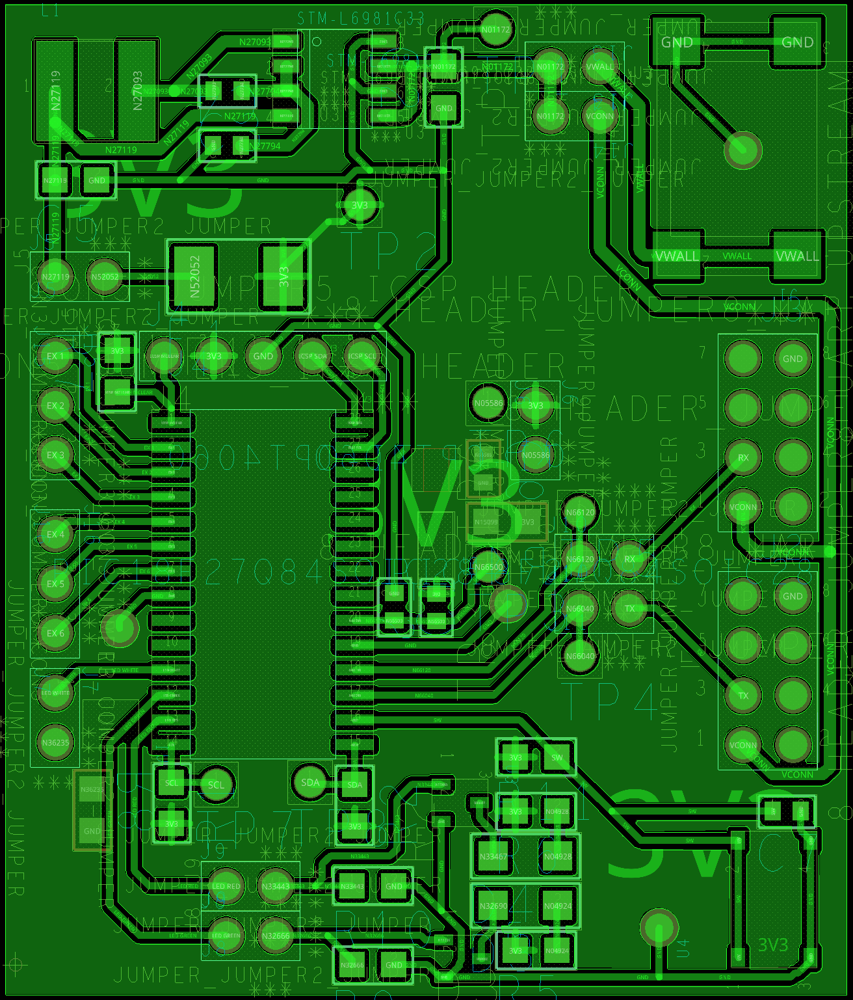
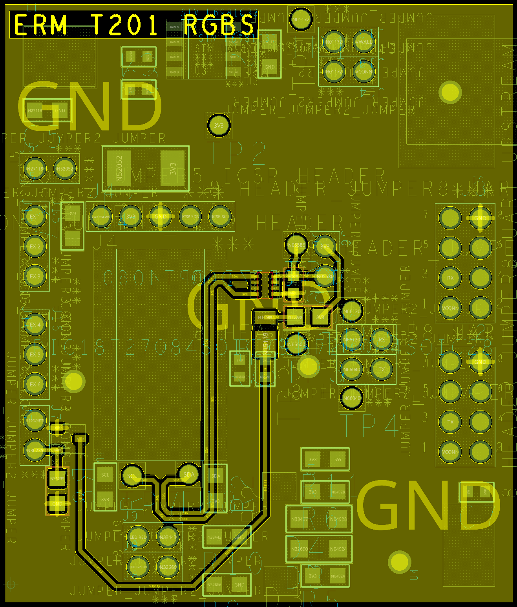

# RGB Sensor Schematic

# Files
 - Cadence OrCAD Schematic and PCB: [link](ZIP/TEAM201%20-%20RGB%20SENSOR%20-%20EMITTLEM.zip)  
 - RGB Sensor Schematic PDF: [link](PDF/TEAM%20201%20-%20RGB%20SENSOR%20-%20EMITTLEM.pdf)
 - Gerber Files: [link](ZIP/EricMittleman201.zip)

# PCB

 **Top View**  
 

 **Bottom View**  
 

# User Needs and Decisions
The schematic and PCB design demonstrate how user needs and project requirements are met. Each function of the sensor is given it's own spot on the board for organiation and ease of operation. The power regulation system is located at the top of the board, and is connected to wall power or team power through one of two selectable headers - one for wall power via barrel jack, and one for team power via ribon cable connected to pin 1 of each 2x4 header. The red and green LEDs are placed on the bottom of the PCB with the debugging pushbutton for easy viewing and opearation. Two 2x4 header pins allow for power to be transfered to each team system (Vin on pin 1, GND on pin 8), and UART communication is passed through pin 3 of these headers - later corrected to pin 2 through jumpers. Additional I/O is provided for users utilizing pins A0:A5 of the microcontroller. Three I/O pins are connected to male headers, and 3 are connected to female headers. MOSFETS are used to isolate the 3.3V power from the microcontroller while operating LEDs, as well as reducing power required to control them Finally, the white illumination LED and OPT4048 sensor are placed on the back of the board allowing them to face the inside of an enclosure for accurate measurement while the user interface remains available outside.

# Version 2.0
If I were able to create a second version of the sensor, I would focus on improving the ribbon cable headers, pysical mounting options, and fixed connections. Due to a misunderstanding in ribbon cable standards, header positioning standards, and physical dimensions, the 2x4 headers used to communicate with and provide power to each board caused multiple problems. To start, the ribbon cable pins are mirrored from the header pins - the top and bottom rows are swapped As a result, the headers needed to be mounted upside down with the pins  on the back of the board, rather than both on front as I originally intended. Dimensioning issues were also a problem as the housing on the headers overlapped and needed to be modified to fit properly. Finally, I misunderstood how header pins were oriented, and placed a trace from the microcontroller to pin 3 of the headers, thinking that the pins were numbered length-wise with two rows of four pins, rather than as four rows of two pins. All of these are fixable and would only require a small increase in the size of the board and minimal trace routing fixes. The board also features no way to mount with screws or clips, and parts sat closer to the edge of the board than I expected resulting in a clunky mounting system in the final project. A second version should include holes for mounting, or at least clear corners to attach to. Finally, I made a critical mistake in the schematic design, and connected pins 2:3 of the voltage regulator by accident. This resulted in incorrect operation and the small size of the traces, components, and pins made fixing the errors difficult.

 Additional but non-critical fixes could be focused on the UART and I2C traces. While there were no communication issues, the I2C lines run in a straight line parallel to each other for a significant distance, and some crosstalk was present in the signal. These traces were only placed 5 mils apart, and could stand to be placed 15 mils apart instead. UART lines, on the other hand, could be placed closer together in a more uniform manner, though the signals did not appear to have any distortion or noise during operation. 