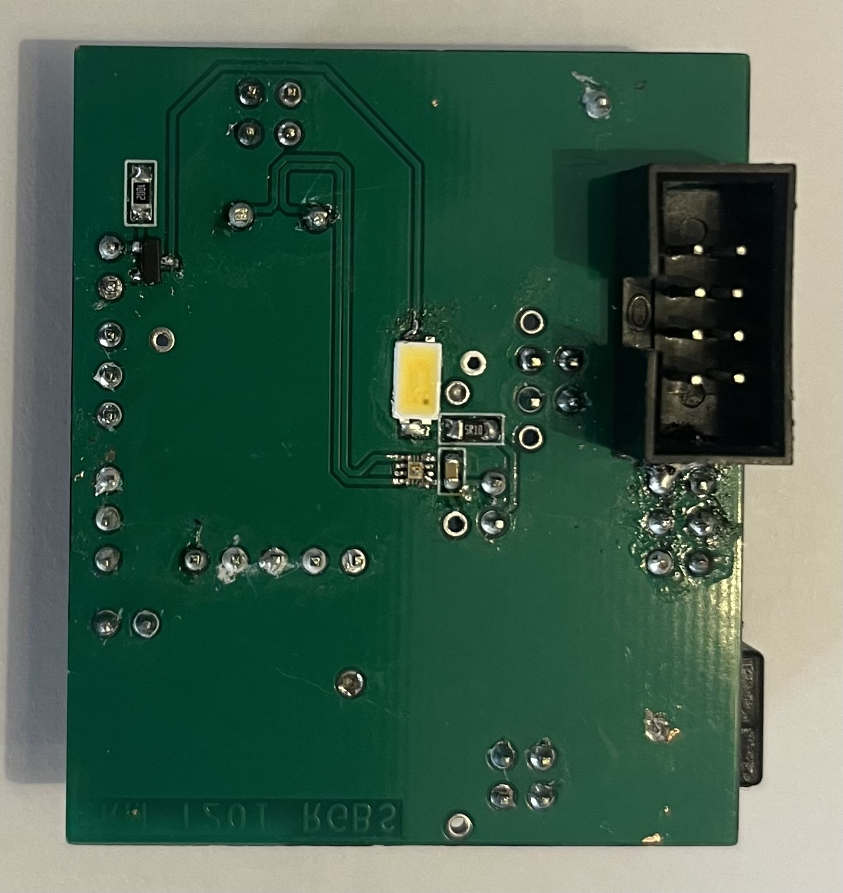
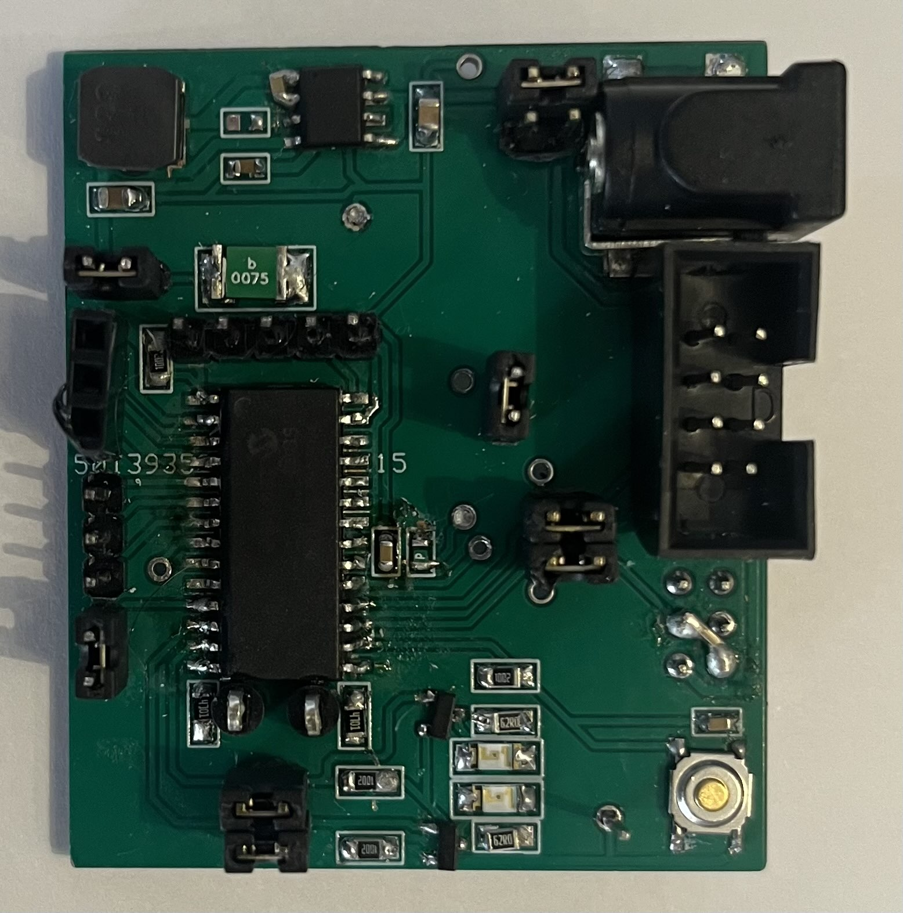
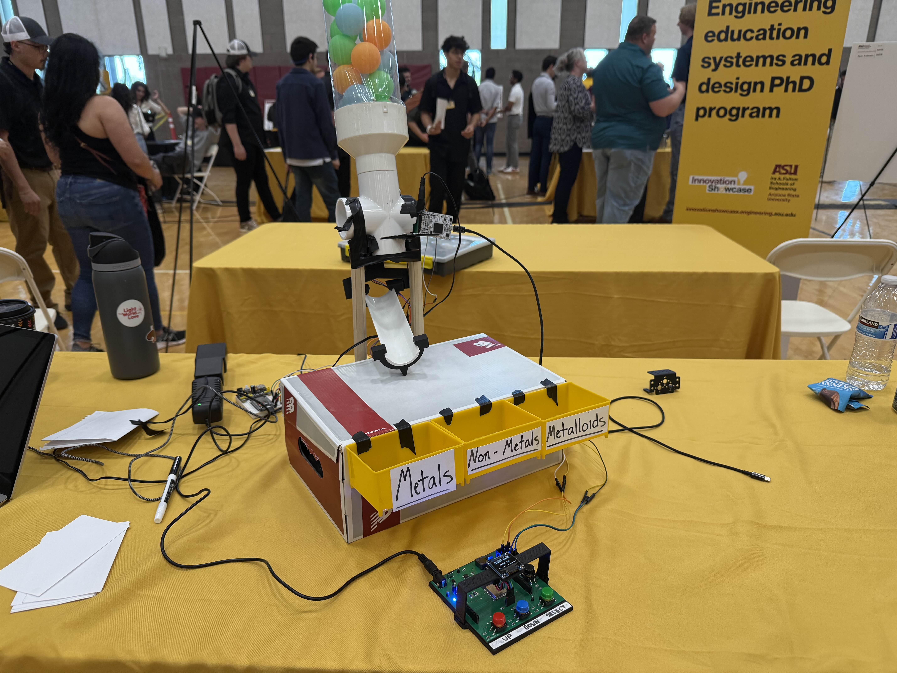

# Homepage
This is E. Mittleman's website for the Spring 2025 semester of EGR314. This site serves as a living document for the RGB sensor subsystem.
The group website (Team 201) can be found [here](https://asu-egr314-2025-s-201.github.io/).

|  |  |
|--------------------------|-------------------------|

## Assignments
| Assignment | Link |
|------------|------|
| Block Diagram | [link](https://e-mittl.github.io/Block%20Diagram/) |
| Component Selection | [link](https://e-mittl.github.io/Component%20Selection/) | 
| Individual Schematic | [link](https://e-mittl.github.io/Schematic/) | 
| Bill of Materials | [link](https://e-mittl.github.io/BOM/) |
| API | [link](https://e-mittl.github.io/API/) |
| Resources | [link](https://e-mittl.github.io/Resources) |